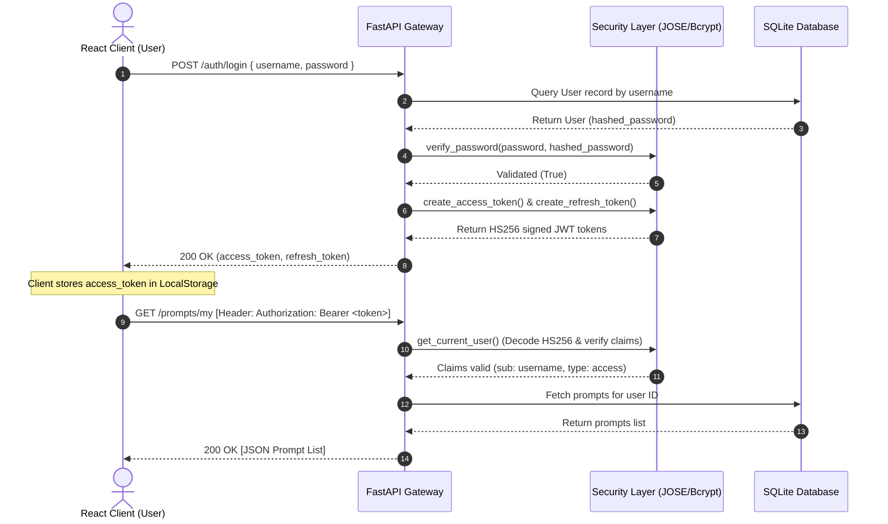

# 🔑 PromptVault

[](LICENSE)
[](https://fastapi.tiangolo.com/)
[](https://www.sqlite.org/)
[](https://jwt.io/)
[](https://react.dev/)

> **Secure AI Prompt Store & Token Compiler** — A full-stack vault designed to save, search, edit, and classify AI system instructions and prompt templates. Securely gated by JWT session verification and styled in a premium glassmorphic dark theme.

---

## 🔒 JWT Authentication Lifecycle



---

## 🛠️ Tech Stack

* **Backend**: FastAPI, SQLAlchemy, SQLite, passlib (Bcrypt hashing), python-jose (JWT validation).
* **Frontend**: React (Vite-scaffolded), Lucide-react, CSS Glassmorphism.
* **Database**: SQLite (local single-file database).

---

## 🚀 Installation & Local Development

### 1. Backend Server Setup
Create a `.env` configuration file in `backend/`:

```env
SECRET_KEY=your_super_secret_key_change_this_in_production
ALGORITHM=HS256
ACCESS_TOKEN_EXPIRE_MINUTES=30
REFRESH_TOKEN_EXPIRE_DAYS=7
```

Activate virtual environment and run the server:

```bash
cd backend
python -m venv venv
source venv/bin/activate  # Windows: venv\Scripts\activate
pip install -r requirements.txt
uvicorn main:app --reload --port 8000
```
API Swagger docs will be live at `http://localhost:8000/docs`.

### 2. React Client Setup

```bash
cd frontend
npm install
npm run dev
```
Open `http://localhost:5173` to access the PromptVault Dashboard.

---

## ⚙️ GitHub Repository Configuration

To optimize your repository index card on GitHub, update the following fields in your repo settings:

* **About Section**:
  > A full-stack AI prompt management vault. Features a FastAPI REST backend gated by JWT access/refresh token pairs, SQLAlchemy SQLite storage, and a responsive glassmorphic React dashboard with tag search filters.
* **Topics/Keywords**:
  `fastapi`, `reactjs`, `jwt-authentication`, `sqlite`, `sqlalchemy`, `prompt-engineering`, `full-stack`, `developer-tools`
